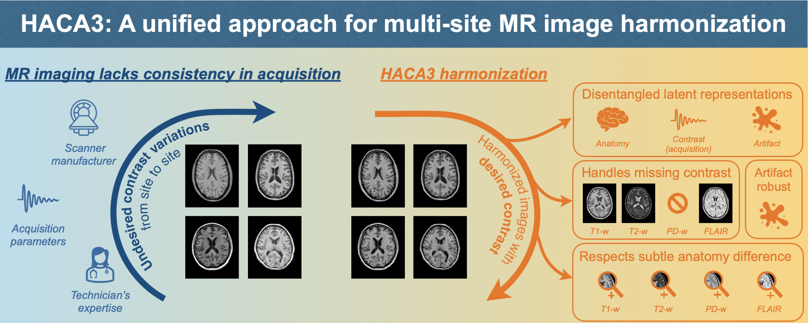
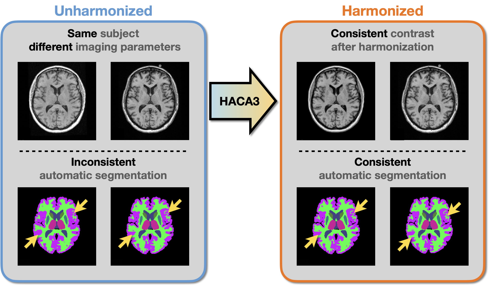
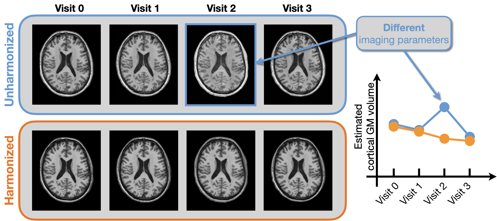

# HACA3: A unified approach for multi-site MR image harmonization | [Paper](https://www.sciencedirect.com/science/article/pii/S0895611123001039)

HACA3 is an advanced approach for multi-site MRI harmonization. This page provides a gentle introduction to HACA3 inference and training. 

- Publication: [Zuo et al. HACA3: A unified approach for multi-site MR image harmonization. *Computerized Medical Imaging 
and Graphics, 2023.*](https://www.sciencedirect.com/science/article/pii/S0895611123001039)

- Citation:    
    ```bibtex
    @article{ZUO2023102285,
    title = {HACA3: A unified approach for multi-site MR image harmonization},
    journal = {Computerized Medical Imaging and Graphics},
    volume = {109},
    pages = {102285},
    year = {2023},
    issn = {0895-6111},
    doi = {https://doi.org/10.1016/j.compmedimag.2023.102285},
    author = {Lianrui Zuo and Yihao Liu and Yuan Xue and Blake E. Dewey and
              Samuel W. Remedios and Savannah P. Hays and Murat Bilgel and 
              Ellen M. Mowry and Scott D. Newsome and Peter A. Calabresi and 
              Susan M. Resnick and Jerry L. Prince and Aaron Carass}
    }
    ```

### Recent Updates
- August 11, 2024 - **An [interactive demo](https://colab.research.google.com/drive/1PeBuqOAGupLQ2gXWVneX1Kn31ISh4oFB?authuser=1#scrollTo=ujYSa4sBBKVA) for HACA3 now available.** You can explore HACA3 harmonization and imputation real time.

## 1. Introduction and motivation
### 1.1 The double-edged sword of MRI: flexibility and variability
Magnetic resonance imaging (MRI) is a powerful imaging technique, offering flexibility in capturing various tissue
contrasts in a single imaging session. For example, T1-weighted, T2-weighed, and FLAIR images can be acquired in a single
imaging session to provide comprehensive insights into different tissue properties. However, this flexibility comes at 
a cost: ***lack of standardization and consistency*** across imaging studies. Several factors contribute to this 
variability, including but not limited to
- Pulse sequences, e.g., MPRAGE, SPGR
- Imaging parameters, e.g., flip angle, echo time
- Scanner manufacturers, e.g, Siemens, GE
- Technician and site preferences. 

### 1.2 Why should we harmonize MR images?
Contrast variations in MR images may sometimes be subtle but are often significant enough to impact the quality and 
reliability of ***multi-site*** and ***longitudinal*** studies. 

- ***Example #1***: Multi-site inconsistency. In this example, two images were acquired at different sites using 
distinct imaging parameters. This led to ***different image contrast for the same subject***. As a result, an automatic 
segmentation algorithm produced inconsistent outcomes due to these contrast differences. Harmonization effectively 
alleviates this issue. 
<div align="center">
    
</div>

- ***Example #2***: Longitudinal study. In this example, longitudinal images were acquired during four different visits. 
During Visit #2, the imaging parameters were altered (due to unexpected reasons), causing a noticeable jump in the 
estimated volumes of cortical gray matters (GM). Given the cortical GM volume at Visit #3, this jump is unlikely to be 
a result of actual biological changes. Harmonization makes the longitudinal trend more biological plausible. See my
[CMSC2023 talk](https://www.youtube.com/watch?v=TpdB55wxgs4&t=2s) to learn more about how harmonization helps 
longitudinal study.
<div align="center">
    
</div>


## 2. Prerequisites 
Standard neuroimage preprocessing steps are needed before running HACA3. These preprocessing steps include:
- Inhomogeneity correction
- Super-resolution for 2D acquired scans. This step is optional, but recommended for optimal performance. 
See [SMORE](https://github.com/volcanofly/SMORE-Super-resolution-for-3D-medical-images-MRI) for more details.
- Registration to MNI space (1mm isotropic resolution). HACA3 assumes a spatial dimension of 192x224x192.

## 3. Installation and pretrained weights

### 3.1 Option 1 (recommended): Run HACA3 through singularity image
In general, no installation of HACA3 is required with this option. 
Singularity image of HACA3 model can be directly downloaded [**here**](https://iacl.ece.jhu.edu/~lianrui/haca3/haca3_v1.0.9.sif).


### 3.2 Option 2: Install from source using `pip`
1. Clone the repository:
    ```bash
    git clone https://github.com/lianruizuo/haca3.git 
    ```
2. Navigate to the directory:
    ```bash
    cd haca3
    ```
3. Install dependencies:
    ```bash
    pip install . 
    ```
Package requirements are automatically handled. To see a list of requirements, see `setup.py` L50-60. 
This installs the `haca3` package and creates two CLI aliases `haca3-train` and `haca3-test`.


### 3.3 Pretrained weights
Pretrained weights of HACA3 can be downloaded [**here**](https://iacl.ece.jhu.edu/~lianrui/haca3/harmonization_public.pt). 
This model was trained on public datasets including the structural MR images from [IXI](https://brain-development.org/ixi-dataset/), 
[OASIS3](https://www.oasis-brains.org), and [BLSA](https://www.nia.nih.gov/research/labs/blsa) dataset.
HACA3 uses a 3D convolutional network to combine multi-orientation 2D slices into a single 3D volume. 
Pretrained fusion model can be downloaded [**here**](https://iacl.ece.jhu.edu/~lianrui/haca3/fusion.pt).

## 4. Usage: Inference

### 4.1 Option 1 (recommended): Run HACA3 through singularity image
   ```bash
   singularity exec --nv -e haca3.sif haca3-test \
   --in-path [PATH-TO-INPUT-SOURCE-IMAGE-1] \
   --in-path [PATH-TO-INPUT-SOURCE-IMAGE-2, IF THERE ARE MULTIPLE SOURCE IMAGES] \
   --target-image [TARGET-IMAGE] \
   --harmonization-model [PRETRAINED-HACA3-MODEL] \
   --fusion-model [PRETRAINED-FUSION-MODEL] \
   --out-path [PATH-TO-HARMONIZED-IMAGE] \
   --intermediate-out-dir [DIRECTORY SAVES INTERMEDIATE RESULTS] 
   ```

- ***Example #3:***
    Suppose the task is to harmonize MR images from `Site A` to match the contrast of a pre-selected T1w image of 
    `Site B`. As a source site, `Site A` has T1w, T2w, and FLAIR images. The files are saved like this:
    ```
    ├──data_directory
        ├──site_A_t1w.nii.gz
        ├──site_A_t2w.nii.gz
        ├──site_A_flair.nii.gz
        └──site_B_t1w.nii.gz
    ```
    You can always retrain HACA3 using your own datasets. In this example, we choose to use the pretrained HACA3 weights 
    `harmonization.pt` and fusion model weights `fusion.pt` (see [3.3 Pretrained weights](#33-pretrained-weights) for 
    how to download these weights). The singularity command to run HACA3 is:
    ```bash
       singularity exec --nv -e haca3.sif haca3-test \
       --in-path data_directory/site_A_t1w.nii.gz \
       --in-path data_directory/site_A_t2w.nii.gz \
       --in-path data_directory/site_A_flair.nii.gz \
       --target-image data_directory/site_B_t1w.nii.gz \
       --harmonization-model harmonization.pt \
       --fusion-model fusion.pt \
       --out-path output_directory/site_A_harmonized_to_site_B_t1w.nii.gz \
       --intermediate-out-dir output_directory
    ```
    The harmonized image and intermediate results will be saved at `output_directory`.


### 4.2 Option 2: Run HACA3 from source after installation
   ```bash
   haca3-test \
   --in-path [PATH-TO-INPUT-SOURCE-IMAGE-1] \
   --in-path [PATH-TO-INPUT-SOURCE-IMAGE-2, IF THERE ARE MULTIPLE SOURCE IMAGES] \
   --target-image [TARGET-IMAGE] \
   --harmonization-model [PRETRAINED-HACA3-MODEL] \
   --fusion-model [PRETRAINED-FUSION-MODEL] \
   --out-path [PATH-TO-HARMONIZED-IMAGE] \
   --intermediate-out-dir [DIRECTORY-THAT-SAVES-INTERMEDIATE-RESULTS] 
   ```


### 4.3 All options for inference
- ```--in-path```: file path to input source image. Multiple ```--in-path``` may be provided if there are multiple 
source images. See the above example for more details.
- ```--target-image```: file path to target image. HACA3 will match the contrast of source images to this target image.
- ```--target-theta```: In HACA3, ```theta``` 
is a two-dimensional representation of image contrast. Target image contrast can be directly specified by providing 
a ```theta``` value, e.g., ```--target-theta 0.5 0.5```. Note: either ```--target-image``` or ```--target-image``` must 
be provided during inference. If both are provided, only ```--target-theta``` will be used.
- ```--norm-val```: normalization value. 
- ```--out-path```: file path to harmonized image. 
- ```--harmonization-model```: pretrained HACA3 weights. Pretrained model weights on IXI, OASIS and HCP data can 
be downloaded [here](https://iacl.ece.jhu.edu/~lianrui/haca3/harmonization_public.pt).
- ```--fusion-model```: pretrained fusion model weights. HACA3 uses a 3D convolutional network to combine multi-orientation
2D slices into a single 3D volume. Pretrained fusion model can be downloaded [here](https://iacl.ece.jhu.edu/~lianrui/haca3/fusion.pt).
- ```--save-intermediate```: if specified, intermediate results will be saved. Default: ```False```. Action: ```store_true```.
- ```--intermediate-out-dir```: directory to save intermediate results.
- ```--gpu-id```: integer number specifies which GPU to run HACA3.
- ```--num-batches```: During inference, HACA3 takes entire 3D MRI volumes as input. This may cause a considerable amount 
GPU memory. For reduced GPU memory consumption, source images maybe divided into smaller batches. 
However, this may slightly increase the inference time.

## 5. Go further with harmonization 
- ***Application #1: Identifying optimal operating contrast.*** With the ability of synthesizing arbitrary 
contrasts of the same underlying anatomy, we use harmonization to identify the optimal operating contrast (OOC) of various
downstream tasks, e.g., different segmentation algorithms. 
  - Publications:   
    [Hays et al. Evaluating the Impact of MR Image Contrast on Whole Brain Segmentation. SPIE 2022.](https://drive.google.com/file/d/1ZxLqJCFORPqhwZCQVM_7r7TwZcn5bbzy/view)   
    [Hays et al. Exploring the Optimal Operating MR Contrast for Brain Ventricle Parcellation. MIDL 2023.](https://openreview.net/pdf?id=3ndjE9eawkr)   
    [Hays et al. Optimal operating MR contrast for brain ventricle parcellation. ISBI 2023.](https://arxiv.org/pdf/2304.02056)   
  
- ***Application #2: Automatic quality assurance.*** Since HACA3 has the ability of identifying images with high artifact
levels, we use the HACA3 artifact encoder to do automatic quality assurance. 
  - Publication:    
    [Zuo et al. A latent space for unsupervised MR image quality control via artifact assessment. SPIE 2023.](https://arxiv.org/pdf/2302.00528)

- ***Application #3: Consistent longitudinal analysis.*** We have identified that inconsistent acquisition can cause 
significant issues in longitudinal volumetric analysis, and harmonization is a solution to alleviate this issue of inconsistency.
  - Publication:   
    [Zuo et al. Inconsistent MR Acquisition in Longitudinal Volumetric Analysis: Impacts and Solutions. CMSC 2023.](https://cmsc.confex.com/cmsc/2023/meetingapp.cgi/Paper/8967) 
  - Video presentation on [YouTube](https://www.youtube.com/watch?v=TpdB55wxgs4&t=2s)

- ***Application #4: Quantifying scanner difference from images.*** In many cases, scanner and acquisition information is 
not immediately available from NIFTI files. The contrast encoder in HACA3 and our previous harmonization model 
[CALAMITI](https://www.sciencedirect.com/science/article/pii/S1053811921008429) provides a way to capture these acquisition differences 
from MR images themselves. This information can be used to inform downstream tasks about the level of data heterogeneity. 
  - Publication:   
    [Hays et al. Quantifying Contrast Differences Among Magnetic Resonance Images Used in Clinical Studies. CMSC 2023.](https://scholar.google.com/citations?view_op=view_citation&hl=en&user=pMxz1VYAAAAJ&citation_for_view=pMxz1VYAAAAJ:qjMakFHDy7sC)


## 6. Acknowledgements
Special thanks to Samuel Remedios, Blake Dewey, and Yihao Liu for their feedbacks on HACA3 code release and this GitHub page.

The authors thank BLSA participants, as well as colleagues of the Laboratory of Behavioral Neuroscience (LBN) of NIA and 
the Image Analysis and Communications Laboratory (IACL) of JHU. 
This work was supported in part by the Intramural Research Program of the National Institutes of Health, 
National Institute on Aging, 
in part by the TREAT-MS study funded by the Patient-Centered Outcomes Research Institute (PCORI) grant MS-1610-37115 
(Co-PIs: Drs. S.D. Newsome and E.M. Mowry), 
in part by the National Science Foundation Graduate Research Fellowship under Grant No. DGE-1746891, 
in part by the NIH grant (R01NS082347, PI: P. Calabresi), National Multiple Sclerosis Society grant (RG-1907-34570, PI: D. Pham), 
and the DOD/Congressionally Directed Medical Research Programs (CDMRP) grant (MS190131, PI: J. Prince).
